# Hi, I'm Adrian 👋

### Full-stack Developer excited on learning new things! 🎓

- 🔭 I’m currently working on Next.js Projects
- 🌱 I’m currently exploring PayloadCMS in depth
- 💬 Ask me about React, Next.js, HTML, CSS, TS, UI/UX
- 📫 How to reach me: [adrianmaj1122@gmail.com](mailto:adrianmaj1122@gmail.com)

### Featured projects ⭐

&nbsp;&nbsp;
 

## Languages and Tools that I know 🛠

 

## Currently learning 📚

## Currently working on ⚙️

 

<h2>Stats 📊</h2>

 
 

